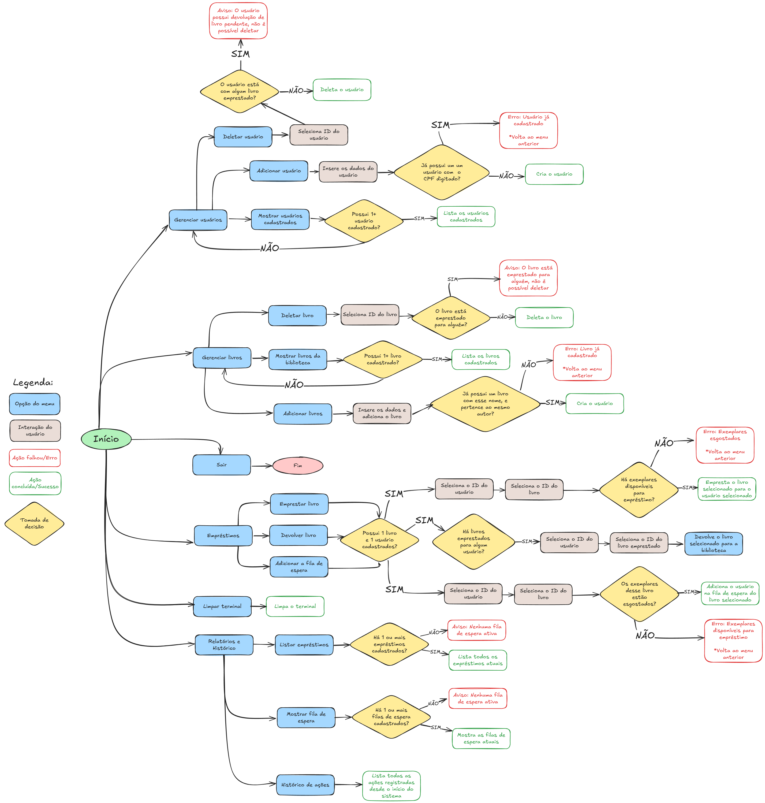

# Sistema de Gerenciamento de Biblioteca - CLI

## Integrantes

- Nome Completo: Daniel Victor Costa  
  RA: 1989218

- Nome Completo: Felipe Souza Garcia  
  RA: 1990279

- Nome Completo: Gustavo Henrique Vieira da Silva  
  RA: 1992080

---

## 1. Descrição do Projeto

O Sistema de Gerenciamento de Biblioteca tem como objetivo fornecer uma solução simples, porém eficiente, para controlar livros, usuários, empréstimos, devoluções e filas de espera. O sistema funciona totalmente em ambiente de linha de comando (CLI), utilizando conceitos de Programação Orientada a Objetos (POO) e estruturas de dados clássicas.

O desenvolvimento do sistema tem como foco a aplicação prática de estruturas como listas encadeadas, pilhas, filas, dicionários e conjuntos, simulando situações reais de gerenciamento de uma biblioteca.

---

## 2. Requisitos para Execução

### 2.1. Ambiente Necessário

- Python 3.10 ou superior instalado na máquina.  
- Editor de código de sua preferência (Visual Studio Code, PyCharm, Jupyter Notebook ou outro).  

### 2.2. Instalação de Dependências

Este projeto não utiliza bibliotecas externas além das nativas do Python. Portanto, não é necessário instalar pacotes adicionais.

### 2.3. Passos para Execução

1. Clone o repositório do projeto ou copie os arquivos para seu ambiente local.

   ```
   git clone https://github.com/GarciaFelipe-1973/P2_Estrutura_De_Dados.git
   ```

2. Acesse a pasta do projeto:

   ```
   cd P2_Estrutura_De_Dados
   ```

3. Execute o arquivo principal:

   ```
   python biblioteca_cli.py
   ```

---

## 3. Funcionamento do Sistema

### 3.1. Funcionalidades

- **Cadastro de Livros:** O sistema permite o registro de livros com informações como título, autor, categorias e quantidade de exemplares disponíveis.
- **Cadastro de Usuários:** Permite cadastrar dados de usuários, como nome, e-mail, telefone e CPF.
- **Empréstimos:** Usuários podem solicitar livros. Caso o livro tenha exemplares disponíveis, o empréstimo é realizado. Se não houver disponibilidade, o usuário é inserido automaticamente em uma fila de espera.
- **Devoluções:** Permite a devolução de livros. Após a devolução, caso haja uma fila de espera para aquele livro, o próximo usuário é notificado e o empréstimo é transferido automaticamente.
- **Relatórios:** Gera relatórios completos que incluem:
  - Livros emprestados no momento.
  - Situação atual das filas de espera.
  - Histórico de todas as ações realizadas (empréstimos, devoluções e cadastros).

### 3.2. Interface

Toda a interação ocorre por meio de menus no terminal, solicitando informações ao usuário e exibindo os dados conforme necessário.

---

## 4. Justificativa das Estruturas de Dados

O projeto foi planejado utilizando diferentes estruturas de dados, cada uma escolhida de forma estratégica para atender às necessidades específicas das funcionalidades propostas.

| Estrutura de Dados | Aplicação no Sistema | Justificativa |
|--------------------|-----------------------|----------------|
| **Lista Encadeada** | Histórico de operações (empréstimos, devoluções, cadastros) | Permite registrar e acessar ações na ordem em que ocorreram, além de ser eficiente para inserções constantes no início da lista, com baixo consumo de memória. |
| **Pilha (Lista Python)** | Controle de ordem dos empréstimos realizados | O modelo de Pilha (último a entrar, primeiro a sair) permite rastrear os empréstimos mais recentes, possibilitando consultas ou desfazer ações em uma possível expansão futura. |
| **Fila (Dicionário com listas encadeadas)** | Gerenciamento de fila de espera para livros indisponíveis | A fila mantém a ordem de chegada dos usuários interessados em um livro, garantindo atendimento justo (primeiro a chegar, primeiro a ser atendido). |
| **Dicionário** | Armazenamento de dados dos livros e usuários | Dicionários oferecem acesso rápido por meio de chave (ID), sendo ideais para buscas, cadastros, alterações e remoções. |
| **Conjunto (Set)** | Gerenciamento de categorias dos livros | Permite garantir que não existam categorias duplicadas, além de oferecer operações eficientes de verificação de existência e inserção. |

---

## 5. Conclusão

O Sistema de Gerenciamento de Biblioteca demonstra, de forma prática, como as estruturas de dados são aplicadas em problemas do mundo real. Além de fornecer um meio funcional de controle de uma biblioteca, este projeto serve como base para desenvolvimento futuro, permitindo fácil expansão para inclusão de interface gráfica, persistência em banco de dados ou recursos avançados de relatórios.

---

## 6. Autores

Desenvolvido por: Daniel Victor Costa  
RA: 1989218  
GitHub: [GitHub](https://github.com/userdanieldev?tab=following)  
LinkedIn: [LinkedIn](https://www.linkedin.com/in/daniel-costa-b88a07198/)

Desenvolvido por: Felipe Souza Garcia  
RA: 1990279  
GitHub: [GitHub](https://github.com/GarciaFelipe-1973)  
LinkedIn: [LinkedIn](https://www.linkedin.com/in/felipe-souza-garcia-94252b314/)

Desenvolvido por: Gustavo Henrique Vieira da Silva  
RA: 1992080  
GitHub: [GitHub](https://github.com/GuVieir4)  
LinkedIn: [LinkedIn](https://www.linkedin.com/in/gustavo-henrique-vieira-da-silva-6284b7231/)

---

## 7. Fluxograma do Projeto

Abaixo está representado o fluxograma geral do funcionamento do sistema de gerenciamento da biblioteca, ilustrando o fluxo entre cadastro, empréstimos, devoluções, relatórios e fila de espera.

### 7.1. Visualização

  

### 7.2. Acesso via Link

🔗 [Visualizar Fluxograma do Projeto](https://excalidraw.com/#json=2Cc7CndFa9ie5rPNG863i,BeZRqyAUsIxIfanuaxPMmw)